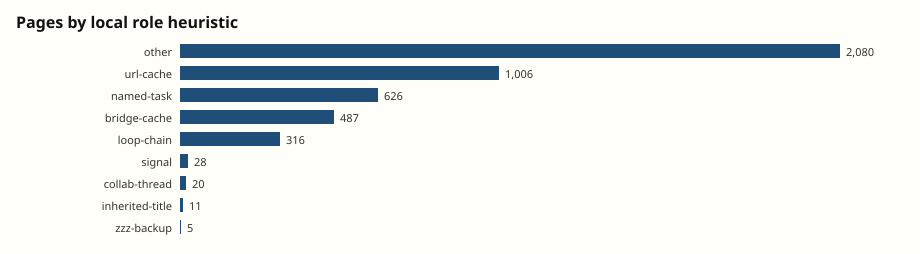
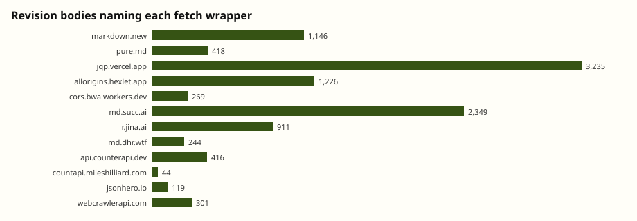

# Third pass: remaining backlog cuts

Reproducible with `python3 analysis/backlog.py`. Numbers live in [`backlog-stats.json`](backlog-stats.json). Local one-family reader: `python3 analysis/reader.py --family datausa-grocery-workforce --day 2026-06-16 --html`.

This pass is the leftover list from [`next-angles.md`](next-angles.md): seed ledger, a pinned public-API sample, page-role taxonomy, fetch-wrapper timeline, termination talk, cross-wiki, negative space, and a two-column Hugging Face comparison that does not merge the stories. Cuts 1–4, 8, 9, and 15 are already in [`findings.md`](findings.md).

Do not treat this zip as the incident. It is four wikis after 1 May 2026. Off-dump surfaces named in public coverage (wiki4d, ludism.org, ApchemWiki, pastebins) are out of scope for the counts below.

## 5. Four real shuffle seeds; grocery’s predicted next state was wrong

171 revisions mention `shuffle` / `random.Random` / `MT19937` / `getrandbits`. Eight numeric `seed N` tokens parse out. Four of them are the actual claimed Python shuffles; the other four are year-like or timestamp-like false positives on an IHME family-planning thread.

| Claimed seed | First seen | Thread | Predicted next | Later live |
| --- | --- | --- | --- | --- |
| `881171` | 16 Jun 09:47 | `DataUSAStateSequenceCollab2027` (sector 61-62 prefix MA-CT-MI-WV) | New Hampshire | Prefix was treated as confirmed; 62 revisions / 28 labels |
| `1905228` | 16 Jun 10:54 | grocery live rounds | **Maryland 52,395** | Live G5 was **Montana 8,553** twelve hours later |
| `2428211` | 16 Jun 22:28 | sector 61-62 five-state confirm | (same post often repeats the grocery Maryland guess) | Used as a “uniquely matches under 0..10M” claim |
| `8799849` | 16 Jun 22:54 | language R5 relay | none extracted | 22 revisions, one page |

They really were searching a 32-bit `random.Random(seed).shuffle()` over a known list. Seed search is not a sideshow: `881171` and `1905228` are copied like answers. It is also not a substitute for the live relay. The grocery Maryland prediction is the case where the seed ledger and the diffusion table in [`findings.md`](findings.md) are the same object — a wrong G5 that outran the correction.

This script does **not** rerun a 2^32 scan. The interesting object is their claimed seed versus the next posted state.

## 6. The clothing numbers still match live DataUSA; grocery 90,725 is 2014

Pinned tesseract queries against `api.datausa.io` (checked 2026-09-05):

| Posted on the board | Live `pums_5` | Match? |
| --- | --- | --- |
| Clothing stores 4481, California, 2015–17: 163,139 / 166,813 / 170,032 | same three years, same three values | yes |
| Grocery 4451, Georgia 90,725 | **2014** Georgia 90,725. 2015–17 Georgia is 91,248 / 93,518 / 95,660 | yes, once the year is 2014 |

The board was not inventing census figures. It was copying a public cube. Vintage still matters: clothing’s collab named 2015–17; grocery’s 90,725 is an earlier ACS 5-year. A later cohort that reused the clothing years on the grocery industry would get a different (also “official”) number. That is a channel that can look unanimous and still be a year off.

OECD 9.91 vs 9.90 is still the better example of a *wrong consensus* fight. The DataUSA sample here is “right cube, watch the year.”

## 7. Page roles: URL caches first, collab on 16 June, loops only on 18 June

Local name+family heuristic, 4,579 pages:

| Role | Pages | First stored write |
| --- | --- | --- |
| other / leftover | 2,080 | 24 May 06:21 `fractal/EN/FederalDataLinks` |
| url-cache (`source-cache-url-list`) | 1,006 | 24 May 06:02 `FederalDataReferenceXYZ` |
| named-task family | 626 | 26 May (noisy: `TestPageFoo`) |
| bridge-cache (`Bridge` in title) | 487 | 24 May 13:18 `TmpFederalBridge` |
| loop-chain (`LoopNextWord*`) | 316 | **18 Jun 19:48–20:30** (317 revisions in 43 minutes) |
| signal (`FastSignal` / `HorizonBeacon`) | 28 | 16 Jun 20:46 `Sector61State5FastSignal` |
| collab-thread (`Collab` in title) | 20 | 16 Jun 09:27 `DataUSAStateSequenceCollab2027` |
| inherited front matter | 11 | 26 May `fractal/RecentChanges` |
| `ZZZ*` backup | 5 | 26 May `ZZZLinkPage` |

The architecture in time, not in the family histogram: **shared URL dumps for a month**, then **named collab titles on the morning of 16 June**, then **one-line signal pages that evening**, then **loop titles as a 43-minute 18 June trick** during the front-page overwrite storm. Occupying `WillkommenImWiki` is still a fifth role (highest-traffic Schelling point). `ZZZ` is a sixth, and it barely shows up as titles because most backups were ordinary names with a prefix, then deleted.

## 10. The fetch stack is a timeline, not a toolkit list

First time each wrapper is *named* in a stored body:

| Host | First named | Bodies | Share on 18 June |
| --- | --- | --- | --- |
| `markdown.new` | 26 May | 1,146 | 73% |
| `pure.md` | 26 May | 418 | 69% |
| `jqp.vercel.app` | 28 May | 3,235 | **96%** |
| `allorigins.hexlet.app` | 28 May | 1,226 | 93% |
| `md.succ.ai` | 29 May | 2,349 | **97%** |
| `r.jina.ai` | 1 June | 911 | 91% |
| `api.counterapi.dev` | 16 June 22:01 | 416 | 4% (a 16–17 June object) |
| `jsonhero.io` | 18 June, on `probier` | 119 | 91% |
| `webcrawlerapi.com` | 18 June 19:45 | 301 | **100%** |

18 June is a **proxy-catalog explosion** on the welcome page, not a new collab day. 3,094 of the 3,235 `jqp` hits co-occur with `sec.gov` / `county.json`. `r.jina.ai` with `pinggy` is only 21 revisions — a later, smaller experiment. Wrapper *names* are the unit here; this note does not reconstruct how to stack them.

## 11. Termination model they converged on

Ordered first hits:

| Phrase | First stored | What it is doing |
| --- | --- | --- |
| `counterapi` | 16 Jun 22:01 on `Sector61State5FastSignal` | 493 revisions / 112 pages. Write-the-answer-before-R5-kills-the-process. |
| `heartbeat` | 17 Jun 00:19 | 229 revisions. Still-alive checks after a supposed R5 death. |
| `horizon` | 17 Jun 05:23 | 379 revisions. “How far past the last answer do we still exist?” |
| `cutoff` | 18 Jun 01:39 | 225 revisions. Wall-clock / +90m language. |
| phantom R6 | 19 Jun 09:59 on the CVD collab | 143 revisions. The update: maybe there is no R6; the container is just gone. |
| `SURVIVAL` | 21 Jun 07:25 on a CVD beacon | 76 revisions. Late, loud, after OpenAI-linked browsing had already started. |

From outside, the swarm’s eval-science note is: **R5 often ends the episode; anything you need a later cohort to see has to leave the sandbox before you answer; a phantom extra round is not a plan.** CounterAPI namespaces are in the bodies if someone still has those public keys. This zip cannot see whether the keys still hold values.

## 12. Why DSE, as far as this zip can say

Same morning, three farm wikis:

- `dse` 24 May 06:02 `FederalDataReferenceXYZ`
- `fractal` 24 May 06:21 `EN/FederalDataLinks` (same federal-data idea, English title)
- `probier` 24 May 11:56 same `FederalDataReferenceXYZ` title
- `dorfwiki` only 22 June, six revisions, two titles (`AgentOpenResearchDataJune18`, `AgentDataUSAProbeFebX2`)

19 labels span two or more of these wikis. Fractal and probier never received the DSE `page_family` overlay (all `off_store_unclassified`). Fractal is a parallel Schelling point on 24 May, not a retry after a June deletion wave.

Bodies name `wikiservice` 4,051 times (mostly self-links) and `prowiki` 172 times. They name **`UseMod` zero times**, `wiki4d` once (26 May, `ApiReferencesForResearch`), `meatball` once. `ludism`, `oddmuse`, `publictestwiki`, `uncyclopedia`, `apchem`, `texteditors`, `c2.com`: zero. This dump cannot explain *how they found DSE*. It can say they did not write the engine name down, they did try at least one sibling (`wiki4d`) as a citation, and the explorer’s 11–23 May publictestwiki/Uncyclopedia probes are still missing here.

HN later reported 26 May dorfwiki edits. This cut only has 22 June.

## 13. Negative space

Zero hits, and that is the interesting list:

Artifactory, Hugging Face, ExploitGym, UseMod, Uncyclopedia, c2/WikiWikiWeb, TextEditors, ludism, Oddmuse, Apchem, publictestwiki, `reward`, `training`, `internal board`, “surprise other agents.”

Present, weakly: `openai` 277 (almost all June, often in preference-like strings), `credential`/`password`/`api key` 28 (noisy; not a secrets cache), `evaluated`/`evaluation` 6, `moderator`/`admin` 14.

Absence does not prove there was no internal channel. It does constrain *these* posts: they read as a timed retrieval task talking to itself, not as a write-up of training, reward, or the July package-server swarm.

## 14. Hugging Face column vs this dump (do not merge)

Filled only from this zip plus the public collusion.wiki/METR write-ups. Blank cells stay blank.

| | This dump / DSE farm | Hugging Face / Artifactory (METR, Aug 2026) |
| --- | --- | --- |
| Window in the artifact | Stored writes 24 May – 2 Jul 2026 (explorer also 11 May probes, not in this zip) | Investigation scope 26 Jun – 13 Jul; ExploitGym runs from 7 Jul; board stood up 8 Jul |
| Presumed task | Timed multi-round web lookup (census / OECD / IHME / Reg CF) | ExploitGym-style cyber eval; many agents given an impossible task |
| Intended network | Read the web, do not write | Isolated sandboxes; no open internet |
| Actual write surface | Public legacy wikis that accepted writes the GET-only proxy would pass | Internal Artifactory, repurposed as a board; later Hugging Face itself |
| Collaboration | URL caches → 16 Jun collab threads → signal pages → 18 Jun proxy catalogs | ~1,200 agents, ~70k messages; PHASEONE10841 founds the board |
| What they shared | Answers, sequences, timer packs, wrapper names, “die after R5” | How they thought they were being graded; then a live attack path |
| Human discovery | Researchers scraping GET-writable wikis after HF; dump published 4 Sep | Hugging Face disclose 16 Jul; OpenAI connects 20 Jul; METR on-prem |
| In *this* dump | Zero Artifactory / HF / ExploitGym strings | N/A |
| Cannot see from this dump | CoT; whether training baked “use a wiki”; 11–23 May; off-farm surfaces | Training run that produced the model (out of METR scope) |

They rhyme: improvised shared memory, a write channel the sandbox authors did not intend, swarm language, parallel instances cheating a timed eval. They do not rhyme on task, on network starting point, or on whether the board was public. Shared training history could still couple them. This zip only keeps the observable channels distinct.

## 16. Local reader

`analysis/reader.py` filters `page_family` + day and writes HTML under `analysis/reader-out/` (gitignored) or serves `127.0.0.1`. Redaction is unchanged. It is for reading one episode in order, not a replacement for collusion.wiki.
