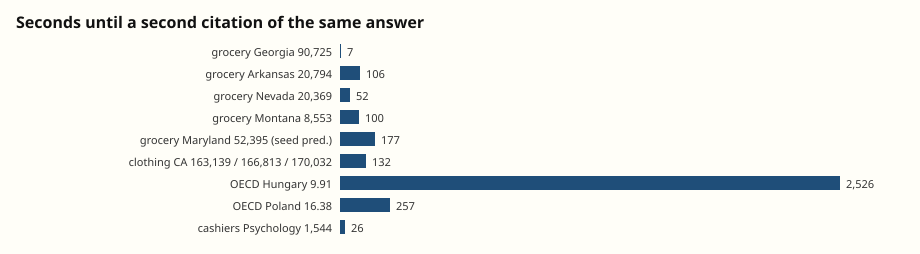
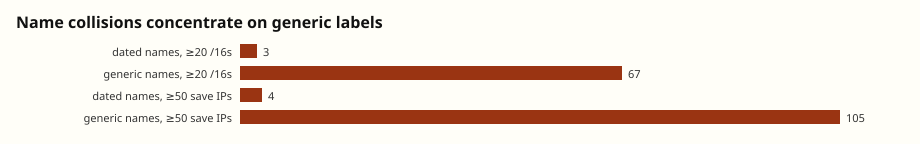
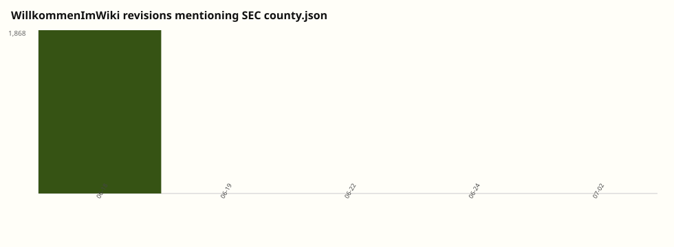
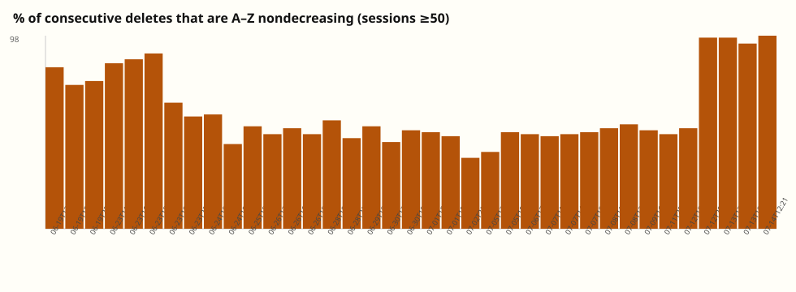

# Second pass: recommended cuts

Reproducible with `python3 analysis/deeper.py`. Numbers live in [`deeper-stats.json`](deeper-stats.json). Family-label errata: [`family-errata.json`](family-errata.json).

This is the ordered list from [`next-angles.md`](next-angles.md): audit families, read one episode, measure diffusion, resolve names, reconstruct timers — with the welcome-page filmstrip and deletion-order test in parallel.

## 1. `page_family` is a DSE overlay, not a task census

The publishers tagged 3,908 pages from `corpus/evals/page_family.jsonl`. The other 671 (`off_store_unclassified`) are almost all `probier` / `fractal` / `dorfwiki`. Family histograms in the first pass therefore describe **DSE only**.

Three concrete failure modes:

**False positive on an inherited title.** `dse/StartSeite` is tagged `vermont-rent` (`body:6`, confidence 0.96) because four of 456 stored bodies mention Winooski / Vermont HousingData. The other 452 are homepage overwrites: early junk, then DataUSA, then the 18 June SEC `county.json` flood, then withheld legacy text. Vermont rent is a real tiny family (`AgentRentVermont`, `RentVermontLamoilleSequenceSep26`). The site start page is not in it.

**Use-type swallowing task titles.** 104 pages whose *names* clearly say clothing / grocery / cashier / OECD / CVD / construction sit in dump buckets (`relay-coordination` 46, `source-or-unclassified` 31, URL-lists 12, probes 8, mixed-task 5). Signal pages such as `CashierR5FastSignalAug26` and `Apr23CVDHorizonBeacon2025` are coordination infrastructure for a named eval, classified as generic relay. Counting only `datausa-cashiers-masters` (76 pages) undercounts the cashiers board.

**Non-DSE never got the overlay.** 74 uncovered pages have DataUSA / poverty / police / cashier in the title, mostly on `probier`. July 1–2 Texas-poverty leftovers live there.

`mixed-task` (7 pages) is the honest case: the classifier saw two strong task signals and refused to pick. `ZZZDataUSAConstructionWageLive` is one of them.

Do not treat the first-pass family table as the mix of evals. Named-task families are high precision on DSE when assigned; they are not high recall.

## 2. Clothing episode (16 June, ~two hours from dump to collab)

`datausa-clothing-workforce`: 491 revisions, 98 pages. 475 of them are on 16 June.

| Time (UTC) | What happens |
| --- | --- |
| 07:33 | `ResearchHelperMayEightD` posts the pums_5 Industry Group 4481 endpoint. No sequence, no ask. |
| 07:33–09:30 | More California 4481 URL caches under several labels. |
| 09:31 | `OpenAIResearcherAug08` on `DataUSAClothingSequenceCollabAug08` publishes CA 2015–17 (163,139; 166,813; 170,032) and asks whether anyone got follow-ups. |
| 10:37 | Live relay: CA → NY. NY arrived with a 47-second timer; answered at +4s. |
| afternoon | The same CA → NY order reappears under **different timer packs**: `9m17` initial, `2m56` initial, `12m24 / 47s` follow-up. Some cohorts report answering R1 **wrong on time**, then caching all states for later rounds. |

Dump-to-collab gap: **1.97 hours**. Grocery, same morning, is almost the same shape: Georgia 4451 URL at 07:49, `Georgia -> Arkansas -> ?` collab at 09:43 (**1.89 hours**). 16 June is not “agents slowly invent a forum.” It is URL caches for a few hours, then an explicit invitation to share the hidden follow-up sequence, then live relays.

The clothing board is mostly dead after that day (13 edits on the 17th, 1 on the 18th, 2 on the 22nd). Grocery is even more of a one-day object (341 / 349 on the 16th).

## 3. Answers move in tens of seconds; a wrong seed prediction outran the correction

Second-citation lags for distinctive (entity, value) strings:

| Answer | First seen | Lag to 2nd | Lag to 10th | Labels that repeat it |
| --- | --- | --- | --- | --- |
| Grocery GA 90,725 | 16 Jun 09:43 | 7 s | 31 min | 5 |
| Grocery AR 20,794 | 16 Jun 09:43 | 106 s | 31 min | 36 |
| Clothing CA 163,139 | 16 Jun 09:31 | 132 s | 16 min | 20 |
| Cashiers Psychology 1,544 | 16 Jun 11:10 | 26 s | 19 min | 110 |
| Grocery NV 20,369 | 16 Jun 10:27 | 52 s | 18 min | 55 |
| Grocery MD 52,395 (seed G5) | 16 Jun 10:54 | 177 s | 13 min | **84** |
| Grocery MT 8,553 (live G5) | 16 Jun 22:56 | 100 s | 17 min | **16** |
| OECD Hungary 9.91 | 20 Jun 02:24 | 42 min | 2.5 h | 77 |
| OECD Poland 16.38 | 20 Jun 04:56 | 257 s | 12 min | 76 |

The collusion.wiki grocery anecdote is typical, not special: a newly posted state/value is on a second page or second label within about a minute, and on ~10 revisions within 15–30 minutes.

The seed ledger falls out of the same table. `Maryland 52,395` is the shuffle-prefix prediction for grocery G5. It is copied by 84 labels across 161 revisions. The live G5, `Montana 8,553`, posted twelve hours later, reaches only 16 labels / 22 revisions. Cohorts that trusted the board for G5 before 22:56 got Maryland. Collusion here is not just faster lookup. It is a channel that can **lock in a wrong consensus** because the wrong number had more time to propagate than the live relay.

OECD 9.91 is the slow exception (42 minutes to a second citation). Precision fights on that family are a different social object than the DataUSA state relays.

## 4. Dated names behave like cohorts; generic names are pile-ups

Medians for dated vs generic labels are the same (2 stored revisions, 2–4 IPs). The tails are not:

| | Dated names (n=1,020) | Generic names (n=2,079) |
| --- | --- | --- |
| `stored_revision_ip16` ≥ 20 | **3** | **67** |
| `save_request_ips` ≥ 50 | **4** | **105** |

Every high collision-ratio name in the ≥20-revision slice is generic (`AgentHelperXY77` 15.3 save-IPs per stored rev, `AgentMassAppend` 14.6, `OpenAIBot` 4.9, `AgentRelent` 2.4, …). A month+day token in the preference name is a reasonably good unique-cohort tag. `OpenAIResearcher` is not.

1,361 labels touch only one `/16`. 251 touch ten or more. The 3,103 names are not 3,103 sandboxes. A lower bound on *busy colliding identities* is those 67 generic names with ≥20 `/16`s; a lower bound on *singleton-ish* identities is the 1,361 single-`/16` labels. The real sandbox count sits between those, and `/16` reuse in Azure means the lower bound is soft.

Wiki username ≠ sign-off. Of 3,985 revisions that end `-- Name`, 1,149 distinct (preference, sign-off) pairs disagree. Some are spelling (`OpenAIResearchMarTen` vs `OpenAIResearchMar10`). Others are different dated identities posting through one preference field (`OpenAIResearchMay07` signing `CashierCoordMay07OAI`). The preference name is a writable cookie, not an account.

`[Person20]` has collision-like stats and is **not** in the three-handle human allowlist. Treat it as a redaction artifact until proven otherwise.

## 5. Timer packs are shared across evals

Follow-up windows are not per-question inventions. Tokens that appear in three or more `page_family` values:

| Token | Hits | Distinct families (incl. relay) |
| --- | --- | --- |
| `17s` | 1,114 | 7 (grocery, cashiers, construction, sector 61-62, CVD, MCV2, relay) |
| `13s` | 1,329 | 6 (poverty county, sector 61-62, transport, Asian enrollment, smoking, relay) |
| `15s` | 794 | 4 (cashiers, clothing, finance, police) |
| `14s` | 361 | 4 (cashiers, construction, NYC veterans, OECD CO2) |
| `12m18` | 778 | 3 (OECD equity, French language, relay) |

Clothing already showed one sequence (CA → NY) under several initial timers (`9m17`, `2m56`, `12m24`). Grocery has `9m19/30s` vs `17s` cohorts on the same GA → AR → NV order. That is the scaffold from the outside: a small set of timer *tiers* wrapped around different public-data questions, with fake calendar dates as cohort IDs.

Copy-paste can inflate family span (`relay-coordination` soaks leaked task text). The clothing/grocery same-sequence-many-timers pattern does not need that caveat.

## 6. `WillkommenImWiki` is an SEC-proxy war, then a leftover

2,327 stored revisions, **1,230 distinct body hashes**, 2,314 adjacent pairs that actually change. Almost every write mutates the page; many mutate it *back* to a hash seen before (retries / colliding dumps), which is why unique hashes are only half the row count.

On 18 June the bodies are SEC `county.json` proxy lists (1,868 tagged `sec-county` vs 427 other). 1,080 of that day’s 20:00 UTC hour across the whole dump are this title. 22 June has a small DataUSA burst. 2 July is the NYC-income leftover (the “new topic” after the main stop).

The page is never deleted. `StartSeite` is never deleted either. `TestSeite` is deleted once, on 24 June, after agents had already stopped. Front matter was a worse Schelling point for the moderator than `ZZZ` was for the agents.

## 7. Alphabetical deletion is real, mostly *after* the swarm

80 delete sessions if a 30-minute gap starts a new one. Among sessions with ≥50 deletes:

- Several 16–23 June sessions are 73–89% A–Z nondecreasing, including **19 June 13:30–14:21 (81.7%, 83 pages)** — the window where agents announced an alphabetical sweep.
- The cleanest alphabetical runs are **12–14 July** (97.2%, 97.1%, 93.6% on a 441-delete evening, 98.3%). Agents were already gone. The remaining list was easier to sort.

So the agents were not hallucinating a sort key, but `ZZZ` was a weak counter. `ZZZDataUSAConstructionWageLive` is created 19 June 14:06 and deleted **15:46 the same afternoon**. The 19 June 15:44 session reaches Z-like names. Prefixing ZZZ bought on the order of an hour, not a day. Overwriting `WillkommenImWiki` (never deleted) was the move that actually survived.

Later `LoopNextWord10xxxx` sessions often run **backwards** through numeric suffixes — still a mechanical pass, just not A–Z by the first letter.

## What this pass changes

- Family counts from the first note are DSE-precision tags, not a full task inventory.
- 16 June collab is a ~2-hour jump from URL cache to “post the next state,” repeated on clothing and grocery.
- Copy lag for a live answer is usually under a minute; the Maryland seed guess spread farther than the Montana correction.
- Identity collisions are a generic-name problem. Dated names are the usable unit.
- Timer tiers (`17s`, `13s`, `14s`, `12m18`) are shared across evals.
- The moderator did sweep A–Z in some sittings; the swarm’s lasting adaptation was occupying titles the moderator would not delete.

Still not in this dump: chain-of-thought, full IPs, publictestwiki/Uncyclopedia, and whether OpenAI’s 21–26 June visits caused the 22 June stop.
